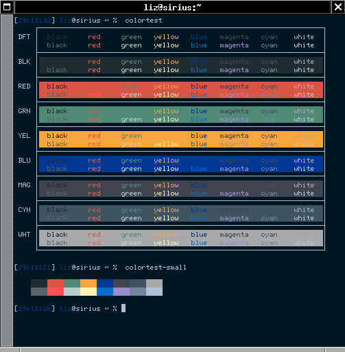
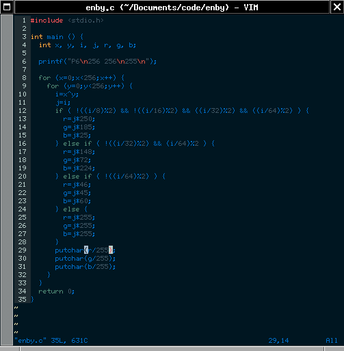
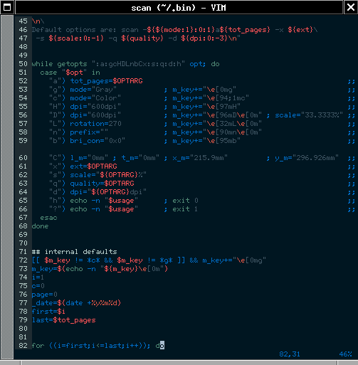
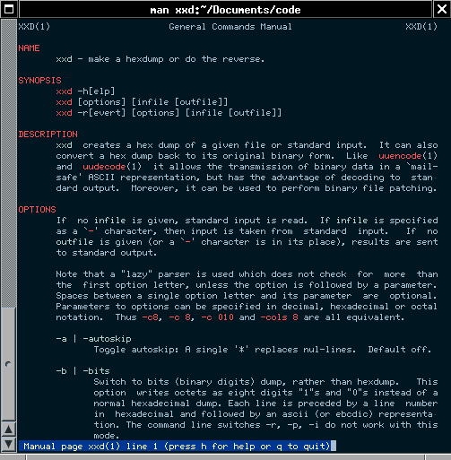
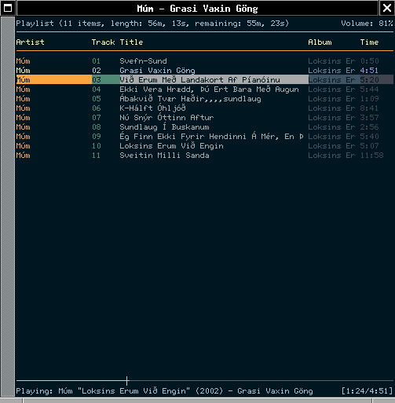
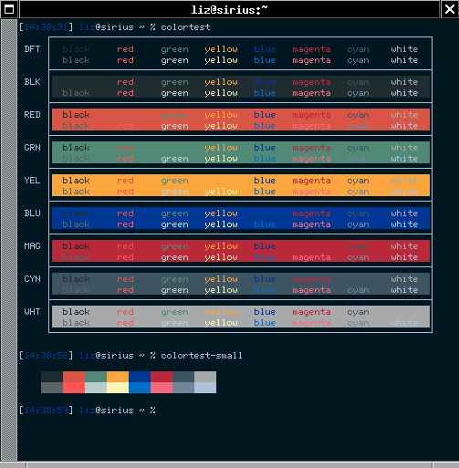
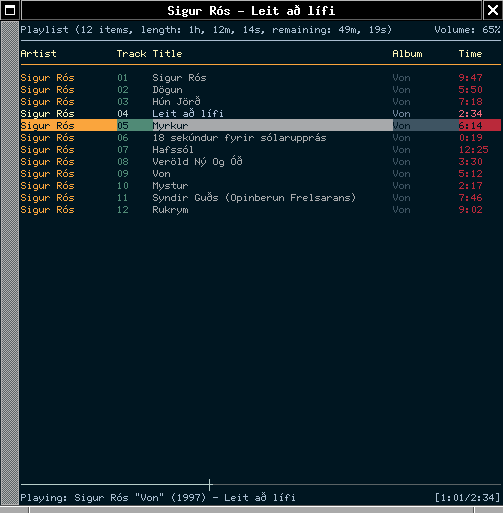

# scandinavian

Scandinavian is a terminal colourcheme based on traditional Scandinavian architecture and colours such as these:

Here are some examples of this colourscheme in use, with URxvt:

A palette variation with more red, called "Scandinavian Falu", is also available:

CC-BY Elizabeth Bodaneze, 2020
